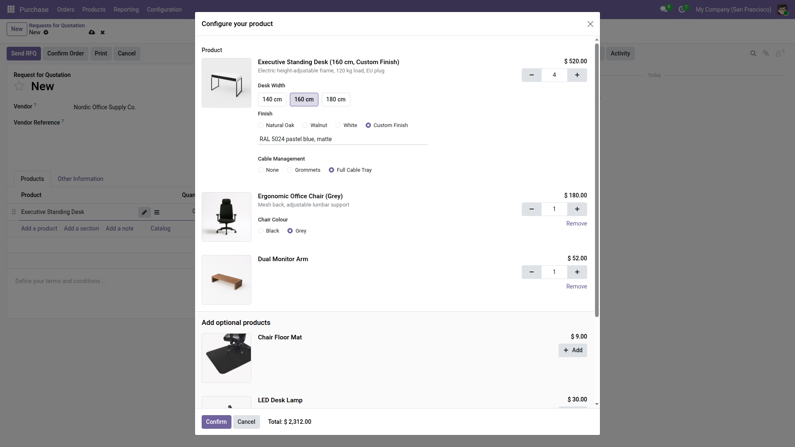
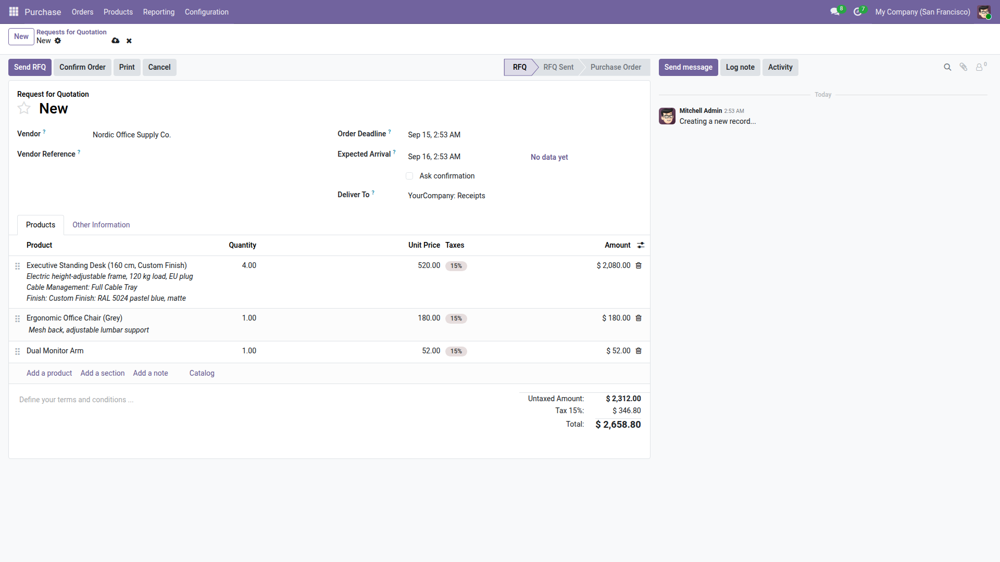
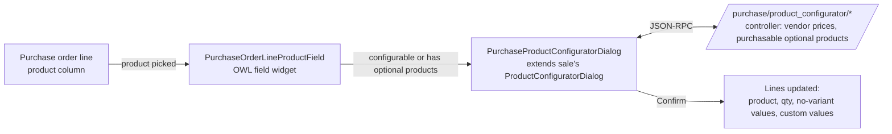

# Purchase Product Configurator for Odoo 19


Odoo's Sales app has a great **product configurator popup**: when a salesperson adds a configurable
product to a quotation, Odoo asks for the attributes (variants, "no variant" options, custom text
values) and proposes the product's *optional products*. Purchasing has nothing like it, so buyers who
order the same configured products from their manufacturer have to type everything by hand.

`purchase_product_configurator` brings that popup to **purchase orders**, with purchase-side rules:
vendor prices instead of pricelist prices, and only products that can actually be purchased.

It was built for a company whose main products are configurable (sizes, finishes, free-text
customisation) and sold with a catalogue of add-ons as optional products. Every unit bought from
the manufacturer now goes through the same popup as the customer's order, so nothing gets lost
between the quotation and the purchase order.



*Example above: a configurable standing desk with vendor prices, a custom finish and add-ons
(demo data from `scripts/setup_demo_data.py`). After confirming, the order lines carry the full
configuration:*



## Features

- Opens the configurator when a product with configurable attributes or optional products is added
  to a purchase order line, exactly like on a sales order line.
- Attributes: variant-creating, dynamic and "no variant" attributes, custom text values, exclusions
  and archived combinations, units of measure / packaging.
- Optional products, including optional products that have their own attributes, added as extra
  lines right after the main product.
- **Vendor prices**: the popup shows the price of the order's vendor (vendor pricelist, quantity and
  date aware), falling back to the product cost. Sales-only "extra price" badges are hidden.
- Only optional products flagged *Can be Purchased* are proposed.
- The chosen configuration is written into the line description, so it appears on the printed
  RFQ / purchase order sent to the vendor.
- A pencil button next to a configurable line re-opens the popup to edit the configuration.
- Works on Odoo 19 Community and Enterprise. Depends only on the standard `purchase` and `sale` apps.

## How it works

The module reuses the Sales configurator components instead of copying them, so it stays small and
follows Odoo upgrades.



| Layer | What the module adds |
| --- | --- |
| `models/purchase_order_line.py` | `product_template_id` (editable, like on sale lines), `is_configurable_product`, `product_custom_attribute_value_ids`; self-cleaning no-variant values; description that includes custom values. |
| `models/product_attribute_custom_value.py` | Link from custom attribute values to purchase order lines. |
| `models/product_template.py` | `get_single_product_variant_for_purchase()`: decides whether the popup must open, counting only purchasable optional products. |
| `controllers/product_configurator.py` | Purchase counterpart of the sale configurator controller. Standalone on purpose: subclassing an Odoo controller would change the Sales routes too. |
| `static/src/js/purchase_product_field.js` | The product column widget (`purchase_configurator_product_many2one`). Applies the product first and the configuration second, because the purchase onchange resets quantity and price. |
| `static/src/js/purchase_product_configurator_dialog.js` | Sale dialog subclass pointing at the purchase routes and passing the vendor. |
| `views/purchase_order_views.xml` | Product column on PO lines switched to the template field with the widget; hidden technical columns. |

## Repository layout

```
addons/purchase_product_configurator/   the installable Odoo module
docker-compose.yml, config/, docker/    local Odoo 19 Community + PostgreSQL 16 stack for development and tests
scripts/setup_demo_data.py              seeds a configurable-desk example (vendor, attributes, add-ons, vendor prices)
docs/                                   screenshots
```

## Local development

Requirements: Docker Desktop, Python 3 (for the seed script).

```bash
# start PostgreSQL + Odoo on http://localhost:8069 (master password "admin")
docker compose up -d

# first time only: create the test database with demo data and the module
docker compose run --rm odoo odoo -d ohs_test -i base,purchase,sale_management,stock,purchase_product_configurator --with-demo --stop-after-init

# seed the configurable-desk example, then log in with admin / admin
python scripts/setup_demo_data.py --db ohs_test

# after changing Python or XML
docker compose run --rm odoo odoo -d ohs_test -u purchase_product_configurator --stop-after-init && docker compose restart odoo
```

### Tests

Seven Python tests (pricing, optional products, descriptions, cleanup) and one browser tour that
drives the real purchase order form in Chrome. The `odoo_test` service is the official image plus
Google Chrome.

```bash
docker compose run --rm odoo_test odoo -d ohs_test -u purchase_product_configurator --test-enable --test-tags /purchase_product_configurator --stop-after-init
```

In Git Bash on Windows, prefix the command with `MSYS_NO_PATHCONV=1` so the `/purchase_...` tag is
not rewritten as a Windows path.

## Installing on a production server

```bash
git clone https://github.com/maryammehboob786/odoo-purchase-product-configurator.git /opt/odoo/odoo-purchase-product-configurator
```

1. Back up the database.
2. Copy `addons/purchase_product_configurator` into a folder listed in `addons_path`
   (`/etc/odoo/odoo.conf`), or add the cloned repository's `addons` folder to `addons_path`.
3. Restart Odoo, e.g. `sudo systemctl restart odoo`.
4. Enable developer mode, open *Apps → Update Apps List*, search **Purchase Product Configurator**,
   click *Install*.
5. Make sure the optional products have *Can be Purchased* ticked and that the vendor has prices on
   the products' *Purchase* tab, otherwise the popup shows the product cost (or 0).

Not compatible with Odoo's *Purchase Matrix* module (`purchase_product_matrix`): both replace the
product column on purchase order lines.

## Roadmap

- Serial-number traceability: copy the add-ons and customisation chosen on the order onto the
  serial number assigned at receipt, so opening a serial shows what was included with that unit.
- Vendor portal: let vendors quote prices on RFQs and report shipping details and status.

## License

[LGPL-3](LICENSE). Built by Maryam Mehboob.
